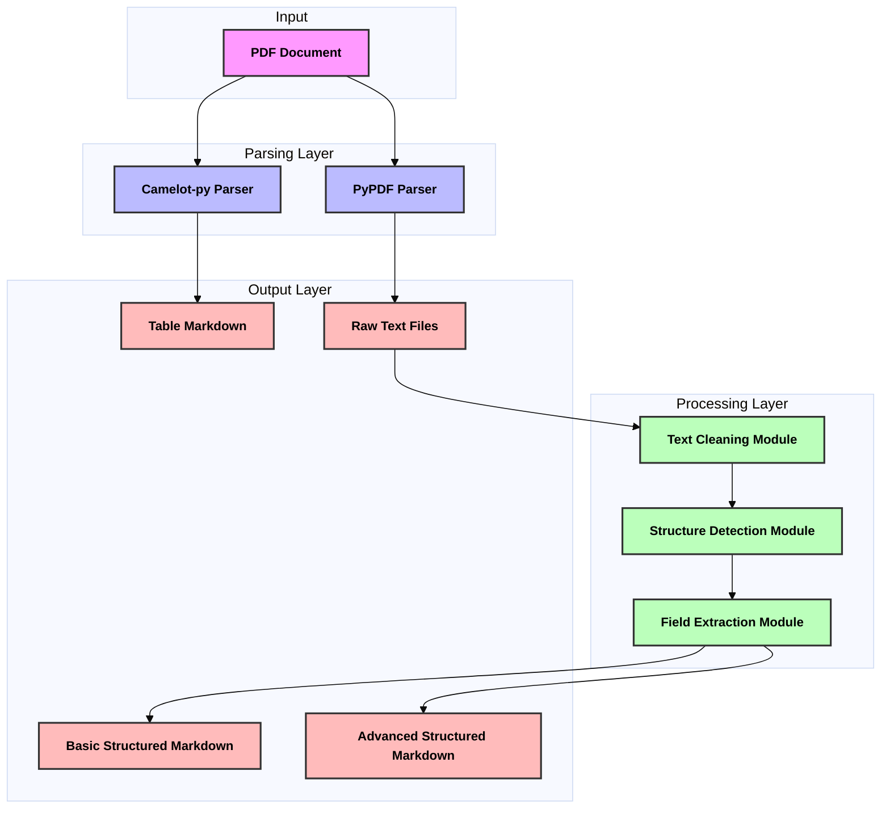
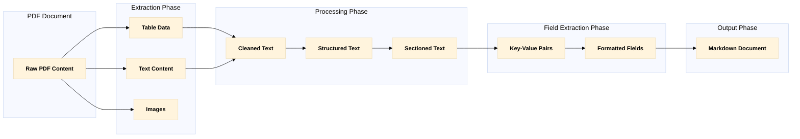
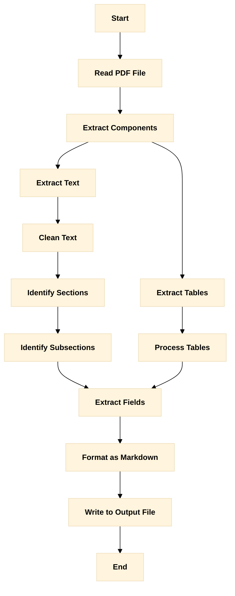
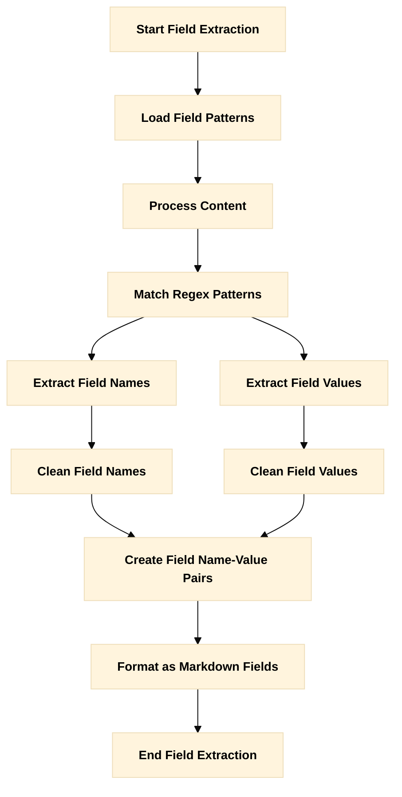

# PDF Parsing Process Documentation

This document provides detailed diagrams explaining the process of converting PDF documents to structured markdown.

## High-Level Architecture



## Data Transformation Pipeline



## PDF Parsing Strategy



## Text Cleaning Process


## Section Detection Process

```mermaid
%%{init: {'theme': 'base', 'themeVariables': { 'fontSize': '16px', 'fontWeight': 'bold', 'primaryTextColor': '#000000' }}}%%
stateDiagram-v2
    [*] --> FullText
    FullText --> SectionIdentification: Identify Known Section Titles
    
    SectionIdentification --> SectionExtraction: Extract Section Content
    SectionExtraction --> SubsectionIdentification: Identify Subsections
    
    SubsectionIdentification --> KeyPhraseDetection: Detect Key Phrases
    SubsectionIdentification --> QuestionDetection: Detect Questions
    SubsectionIdentification --> PatternDetection: Detect Patterns
    
    KeyPhraseDetection --> SubsectionExtraction
    QuestionDetection --> SubsectionExtraction
    PatternDetection --> SubsectionExtraction
    
    SubsectionExtraction --> [*]
    
    classDef default color:#000,font-weight:bold,font-size:14px;
```

## Field Extraction Process



## Comparison of PDF Parsing Methods

```mermaid
%%{init: {'theme': 'base', 'themeVariables': { 'fontSize': '16px', 'fontWeight': 'bold', 'primaryTextColor': '#000000' }}}%%
graph TD
    subgraph "Pipeline Orchestration (pdf_processor.pipeline)"
        P1[Process PDF] --> P2[Ensure Output Directories]
        P2 --> P3[Extract Text and Tables]
        P3 --> P4[Apply Cleaning]
        P4 --> P5[Convert to Enhanced Markdown]
    end
    
    subgraph "Text Extraction (pdf_processor.extractors.text_extractor)"
        T1[Extract Text] --> T2[Clean Text]
        T2 --> T3[Save Page Files]
    end
    
    subgraph "Table Extraction (pdf_processor.extractors.table_extractor)"
        B1[Extract Tables] --> B2[Convert to Markdown]
        B2 --> B3[Save Table Files]
    end
    
    subgraph "Text Cleaning (pdf_processor.utils.cleaning)"
        C1[Basic Cleaning] --> C2[Deep Cleaning]
        C2 --> C3[Ultra-Deep Cleaning]
        C3 --> C4[Enhanced Text Fixing]
    end
    
    subgraph "Enhanced Markdown (pdf_processor.converters.enhanced_markdown)"
        I1[Extract All Text] --> I2[Clean and Process]
        I2 --> I3[Advanced Section Detection]
        I3 --> I4[Pattern-based Field Extraction]
        I4 --> I5[Generate Enhanced Markdown]
    end
    
    classDef pipeline fill:#ffcccc,stroke:#333,stroke-width:1px,color:#000,font-weight:bold,font-size:14px;
    classDef text fill:#ccffcc,stroke:#333,stroke-width:1px,color:#000,font-weight:bold,font-size:14px;
    classDef table fill:#ccccff,stroke:#333,stroke-width:1px,color:#000,font-weight:bold,font-size:14px;
    classDef cleaning fill:#ffffcc,stroke:#333,stroke-width:1px,color:#000,font-weight:bold,font-size:14px;
    classDef enhanced fill:#ffccff,stroke:#333,stroke-width:1px,color:#000,font-weight:bold,font-size:14px;
    
    class P1,P2,P3,P4,P5 pipeline;
    class T1,T2,T3 text;
    class B1,B2,B3 table;
    class C1,C2,C3,C4 cleaning;
    class I1,I2,I3,I4,I5 enhanced;
```


