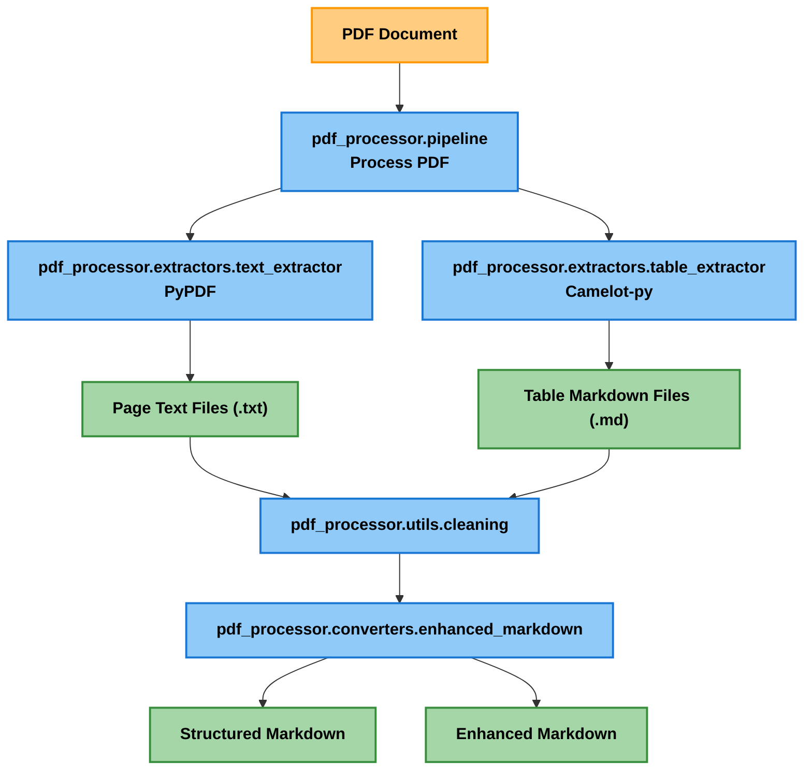
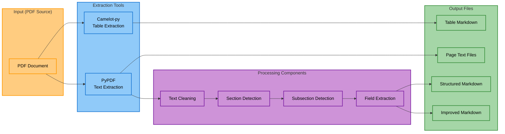

# PDF Processor

> **Note:** For detailed information about our sanitization process, see [SANITIZATION.md](SANITIZATION.md)

# PDF to Markdown Parser

This repository contains a set of scripts to parse PDF documents and convert them into structured markdown format.

## Table of Contents

- [Project Overview](#project-overview)
- [Project Structure](#project-structure)
  - [Main Components](#main-components)
  - [Helper Scripts](#helper-scripts)
  - [Output Directories](#output-directories)
- [Process Flow Diagrams](#process-flow-diagrams)
  - [Overall Workflow](#overall-workflow)
  - [Detailed Process Flow for Enhanced Parser](#detailed-process-flow-for-enhanced-parser)
  - [Component Data Flow](#component-data-flow)
- [Features](#features)
- [Getting Started](#getting-started)
  - [Environment Setup](#environment-setup)
  - [Basic Usage](#basic-usage)
- [Usage Examples](#usage-examples)
  - [Processing Multiple Files](#processing-multiple-files)
  - [Processing Options](#processing-options)
  - [Table Extraction](#table-extraction)
  - [Text Extraction](#text-extraction)
  - [Markdown Generation](#markdown-generation)
- [Managing Output Files](#managing-output-files)
  - [Cleaning Output Files](#cleaning-output-files)
  - [Deleting Output Files](#deleting-output-files)
- [Advanced Features](#advanced-features)
  - [Robust Logging System](#robust-logging-system)
- [Customization](#customization)
- [Performance Considerations](#performance-considerations)

## Project Overview

These scripts are designed to extract text and tables from PDF documents, clean the extracted data, and format it into well-structured markdown files. This can be useful for converting complex PDF documents (like guidebooks, manuals, or reports) into more accessible and readable formats.

## Project Structure

### Main Components

- **pdf_processor/**: Main package
  - **__main__.py**: Command-line interface and entry point
  - **pipeline.py**: Core processing orchestration
  - **config.py**: Configuration settings
  - **extractors/**: Text and table extraction modules
  - **converters/**: Enhanced markdown conversion module
  - **utils/**: Utility functions for cleaning and sanitization

### Helper Scripts

- **delete_outputs.py**: Script to clean output directories
- **tests/test_sanitization.py**: Demo script showing different sanitization levels

### Output Directories

- **data/outputs/text/**: Extracted text files (one per page)
- **data/outputs/tables/**: Extracted tables in markdown format
- **data/outputs/markdown/**: Structured and enhanced markdown files

## Process Flow Diagrams

### Overall Workflow



### Detailed Process Flow for Enhanced Parser

```mermaid
flowchart LR
    subgraph Input["Input (PDF Source)"]
        style Input fill:#ffcc80,stroke:#ff9800,stroke-width:2px
        PDF[<font color="black">PDF Document</font>]
        style PDF fill:#ffcc80,stroke:#ff9800,stroke-width:2px
    end
    
    subgraph Extraction["Extraction Phase"]
        style Extraction fill:#90caf9,stroke:#1976d2,stroke-width:2px
        TextExtractor[<font color="black">Text Extractor Module</font>]
        TableExtractor[<font color="black">Table Extractor Module</font>]
        style TextExtractor fill:#90caf9,stroke:#1976d2,stroke-width:2px
        style TableExtractor fill:#90caf9,stroke:#1976d2,stroke-width:2px
    end
    
    subgraph Processing["Processing Phase"]
        style Processing fill:#ce93d8,stroke:#7b1fa2,stroke-width:2px
        Cleaning[<font color="black">Text Cleaning Module</font>]
        SectionDetection[<font color="black">Section Detection</font>]
        SubsectionDetection[<font color="black">Subsection Detection</font>]
        FieldExtraction[<font color="black">Field Extraction</font>]
        style Cleaning fill:#ce93d8,stroke:#7b1fa2,stroke-width:2px
        style SectionDetection fill:#ce93d8,stroke:#7b1fa2,stroke-width:2px
        style SubsectionDetection fill:#ce93d8,stroke:#7b1fa2,stroke-width:2px
        style FieldExtraction fill:#ce93d8,stroke:#7b1fa2,stroke-width:2px
    end
    
    subgraph Output["Output Files"]
        style Output fill:#a5d6a7,stroke:#388e3c,stroke-width:2px
        TablesMD[<font color="black">Table Markdown</font>]
        PageText[<font color="black">Page Text Files</font>]
        StructuredMD[<font color="black">Structured Markdown</font>]
        EnhancedMD[<font color="black">Enhanced Markdown</font>]
        style TablesMD fill:#a5d6a7,stroke:#388e3c,stroke-width:2px
        style PageText fill:#a5d6a7,stroke:#388e3c,stroke-width:2px
        style StructuredMD fill:#a5d6a7,stroke:#388e3c,stroke-width:2px
        style EnhancedMD fill:#a5d6a7,stroke:#388e3c,stroke-width:2px
    end
    
    PDF --> TextExtractor
    PDF --> TableExtractor
    TableExtractor --> TablesMD
    TextExtractor --> PageText
    TextExtractor --> Cleaning
    Cleaning --> SectionDetection
    SectionDetection --> SubsectionDetection
    SubsectionDetection --> FieldExtraction
    FieldExtraction --> StructuredMD
    FieldExtraction --> EnhancedMD
```



### Component Data Flow



## Features

- **PDF Text Extraction**: Extract text from each page of a PDF document
- **PDF Table Extraction**: Extract tables from PDFs using both lattice and stream methods
- **Structured Markdown Conversion**: Convert PDF content to well-structured markdown
- **Enhanced Formatting**: Apply advanced formatting to improve readability
- **Processing Pipeline**: Run the entire process with a single command
- **Robust Logging**: Comprehensive logging system with configurable log levels and file output

## Getting Started

### Environment Setup

It's recommended to use a conda environment:

```bash
# Create a new conda environment with Python 3.11
conda create -n pdf_parser python=3.11
conda activate pdf_parser

# Install dependencies using requirements.txt
pip install -r requirements.txt

# Or install packages individually
pip install pypdf==3.17.4 camelot-py==1.0.0 pandas==2.2.3 opencv-python-headless tabulate pdfminer-six
```

On macOS, you may need to install ghostscript (required by camelot-py):
```bash
# Using Homebrew
brew install ghostscript

# Using MacPorts
port install ghostscript
```

> **⚠️ Important:** Ghostscript is **required** for table extraction. If you encounter a "Ghostscript is not installed" error even after installation, you may need to set the `GS_PATH` environment variable:
> ```bash
> # Set GS_PATH environment variable before running
> export GS_PATH=/usr/local/bin/gs  # or path to your gs executable
> python -m pdf_processor your_pdf_file.pdf
> ```

On Linux:
```bash
# Debian/Ubuntu
sudo apt-get install ghostscript

# Fedora/RHEL
sudo dnf install ghostscript
```

On Windows:
```bash
# Using Chocolatey
choco install ghostscript
```

### Basic Usage

The PDF processor is designed to be simple to use. The most common usage is:

```bash
# Process a single PDF file
python -m pdf_processor path/to/your/file.pdf

# Process all PDF files in the data/sourcedocs directory
python -m pdf_processor
```

This will:
1. Extract text from each page
2. Extract tables from the document
3. Clean and sanitize the extracted content
4. Generate structured markdown output

All output files will be created in the appropriate subdirectories under `data/outputs/`.

## Usage Examples

### Processing Multiple Files

Process multiple PDF files at once:

```bash
python -m pdf_processor file1.pdf file2.pdf file3.pdf
```

### Processing Options

The processor supports various options:

```bash
python -m pdf_processor [OPTIONS] [pdf_paths ...]

Options:
  --log-level {DEBUG,INFO,WARNING,ERROR,CRITICAL}
                        Set the logging level (default: INFO)
```

Run with detailed debugging information:
```bash
python -m pdf_processor --log-level=DEBUG path/to/your/file.pdf
```

Run with minimal logging (only warnings and errors):
```bash
python -m pdf_processor --log-level=WARNING path/to/your/file.pdf
```

### Table Extraction

Tables are automatically extracted as part of the main pipeline:

```bash
python -m pdf_processor path/to/your/file.pdf
```

This will create markdown files for tables found in the PDF in the `data/outputs/tables` directory.

### Text Extraction

Text extraction is handled by the main processing pipeline:

```bash
python -m pdf_processor path/to/your/file.pdf
```

This will create text files for each page of the PDF in the `data/outputs/text` directory.

### Markdown Generation

To generate structured markdown files from the PDF:

```bash
python -m pdf_processor path/to/your/file.pdf
```

This will create both `data/outputs/markdown/{pdf_name}_structured.md` and `data/outputs/markdown/{pdf_name}_enhanced.md` files with proper section recognition and field extraction.

## Managing Output Files

The project includes two specialized scripts for managing output files:

### 1. Cleaning Output Files

The sanitization script can be run to fix encoding issues and improve formatting in the output files:

```bash
# Cleaning is now integrated into the main pipeline and applied automatically
# There is no need to run separate cleaning scripts

# Process your PDFs to get cleaned output
python -m pdf_processor path/to/your/file.pdf

# Process all PDFs in the data/sourcedocs directory
python -m pdf_processor
```

### 2. Deleting Output Files

The `delete_outputs.py` script is used to delete generated files to start fresh. It recreates the directory structure after deletion and always preserves README.md files.

```bash
# Delete all generated content
python delete_outputs.py

# Delete only specific output types
python delete_outputs.py --tables    # Delete only table files
python delete_outputs.py --text      # Delete only text files 
python delete_outputs.py --markdown  # Delete only markdown files

# Specify a custom output directory
python delete_outputs.py --output-dir=./custom_outputs

# Combine options as needed
python delete_outputs.py --tables --text
```

The sanitize script will:
1. Fix common encoding issues in extracted files
2. Improve formatting and readability
3. Allow selective cleanup of specific output types
4. Support custom output directories
5. Show the directory structure after deletion is complete

The delete script will:
1. Remove generated files while preserving the directory structure
2. Always preserve README.md files in output directories
3. Allow selective deletion of specific output types
4. Support custom output directories
5. Show the directory structure after deletion is complete

## Advanced Features

### Robust Logging System

The project includes a comprehensive logging system that provides:

1. **Console Output**: Color-coded log messages displayed in the terminal
2. **File Logging**: Detailed logs saved to timestamped files in the `logs/` directory
3. **Configurable Log Levels**: Set logging verbosity (DEBUG, INFO, WARNING, ERROR, CRITICAL)
4. **Different Log Formats**: Console logs are concise and color-coded, while file logs include timestamps and module info

Use the logging features by adding the `--log-level` argument:

```bash
# Run with detailed debugging information
python -m pdf_processor --log-level=DEBUG

# Run with minimal logging (only warnings and errors)
python -m pdf_processor --log-level=WARNING
```

Log files can be found in the `logs/` directory with timestamps for easy identification.

## Customization

- **Known Sections**: Edit the `KNOWN_SECTIONS` list in the scripts to match the sections in your PDF.
- **Field Patterns**: Modify the `FIELD_PATTERNS` list in `pdf_to_enhanced_markdown.py` to extract specific fields from your PDF.
- **Subsection Mapping**: Update the `SECTION_SUBSECTIONS` dictionary to define expected subsections for each main section.

## Performance Considerations

- Large PDFs may require more processing time
- Complex formatting in PDFs might affect extraction accuracy
- PDFs with unusual characters or encoding may require additional cleaning steps
