# PDF Processor

> **Note:** For detailed information about our sanitization process, see [SANITIZATION.md](SANITIZATION.md)

# PDF to Markdown Parser

This repository contains a set of scripts to parse PDF documents and convert them into structured markdown format.

## Project Overview

These scripts are designed to extract text and tables from PDF documents, clean the extracted data, and format it into well-structured markdown files. This can be useful for converting complex PDF documents (like guidebooks, manuals, or reports) into more accessible and readable formats.

## Project Structure

### Main Components

- **pdf_processor/**: Main package
  - **__main__.py**: Command-line interface and entry point
  - **pipeline.py**: Core processing orchestration
  - **config.py**: Configuration settings
  - **extractors/**: Text and table extraction modules
  - **converters/**: Enhanced markdown conversion module
  - **utils/**: Utility functions for cleaning and sanitization

### Helper Scripts

- **delete_outputs.py**: Script to clean output directories
- **test_sanitization.py**: Demo script showing different sanitization levels

### Output Directories

- **data/outputs/text/**: Extracted text files (one per page)
- **data/outputs/tables/**: Extracted tables in markdown format
- **data/outputs/enhanced_markdown/**: Enhanced markdown with integrated tables

## Process Flow Diagrams

### Overall Workflow

```mermaid
graph TD
    PDF[PDF Document] --> PipelineModule[pdf_processor.pipeline\nProcess PDF]
    PipelineModule --> TextExtractor[pdf_processor.extractors.text_extractor\nPyPDF]
    PipelineModule --> TableExtractor[pdf_processor.extractors.table_extractor\nCamelot-py]
    TextExtractor --> ExtractedText["Page Text Files (.txt)"]
    TableExtractor --> TablesMarkdown["Table Markdown Files (.md)"]
    ExtractedText --> CleaningModule[pdf_processor.utils.cleaning]
    TablesMarkdown --> CleaningModule
    CleaningModule --> EnhancedMarkdown[pdf_processor.converters.enhanced_markdown]
    EnhancedMarkdown --> StructuredMD["Structured Markdown"]
    EnhancedMarkdown --> ImprovedMD["Enhanced Markdown"]
    
    classDef input fill:#f9f,stroke:#333,stroke-width:2px;
    classDef process fill:#bbf,stroke:#333,stroke-width:2px;
    classDef output fill:#bfb,stroke:#333,stroke-width:2px;
    
    class PDF input;
    class PipelineModule,TextExtractor,TableExtractor,CleaningModule,EnhancedMarkdown process;
    class TablesMarkdown,ExtractedText,StructuredMD,ImprovedMD output;
```



### Detailed Process Flow for Enhanced Parser


### Component Data Flow


## Features

- **PDF Text Extraction**: Extract text from each page of a PDF document
- **PDF Table Extraction**: Extract tables from PDFs using both lattice and stream methods
- **Structured Markdown Conversion**: Convert PDF content to well-structured markdown
- **Enhanced Formatting**: Apply advanced formatting to improve readability
- **Processing Pipeline**: Run the entire process with a single command
- **Robust Logging**: Comprehensive logging system with configurable log levels and file output

## Advanced Features

### Robust Logging System

The project includes a comprehensive logging system that provides:

1. **Console Output**: Color-coded log messages displayed in the terminal
2. **File Logging**: Detailed logs saved to timestamped files in the `logs/` directory
3. **Configurable Log Levels**: Set logging verbosity (DEBUG, INFO, WARNING, ERROR, CRITICAL)
4. **Different Log Formats**: Console logs are concise and color-coded, while file logs include timestamps and module info

Use the logging features by adding the `--log-level` argument:

```bash
# Run with detailed debugging information
python pdf_processing_pipeline.py --log-level=DEBUG

# Run with minimal logging (only warnings and errors)
python pdf_processing_pipeline.py --log-level=WARNING
```

Log files can be found in the `logs/` directory with timestamps for easy identification.

## Recent Improvements

### Updated on February 26, 2025

1. **Consolidated Sanitization Tools**
   - Created a unified sanitization interface with three cleaning levels: basic, deep, and ultra
   - Consolidated overlapping functionality from multiple scripts for clearer code organization
   - Added comprehensive documentation and usage examples for all sanitization levels

2. **Enhanced Markdown Cleanup**
   - Improved handling of encoding issues in markdown files
   - Added special handling for `improved_guidebook.md` and `structured_guidebook.md` with complete replacements
   - Fixed header formatting and structure in markdown files
   - Added metadata notes to indicate when files were last cleaned

3. **Text File Improvements**
   - Enhanced text extraction with better encoding handling
   - Implemented systematic cleaning of extracted text files

4. **Dynamic File Naming**
   - Modified the PDF processing pipeline to generate output files named by the original PDF filename
   - Generated files now follow patterns like `{pdf_name}_structured.md`, `{pdf_name}_improved.md`, etc.
   - Provides clear traceability between source PDFs and generated files

5. **Development Environment**
   - Added requirements.txt with specific package versions for reproducible environment setup
   - Updated conda environment setup instructions with Python 3.11 specification
   - Added detailed installation instructions for different operating systems

## Sanitization Improvements

Our sanitization pipeline now includes several critical improvements:

1. **Binary-Level Cleaning**: 
   - Addresses hidden control characters (like 0x03) that disrupt text flow but aren't visible in text editors
   - Applied at all sanitization levels

2. **Pattern-Based Cleaning**:
   - Document-specific patterns are now detected and fixed
   - Common patterns like run-together words are automatically separated

3. **Error Handling**:
   - Improved error handling ensures the pipeline continues even if specific cleaning steps fail
   - Detailed error logging helps diagnose issues with specific files

4. **Custom Cleanup Tool**:
   - Added `final_cleanup.py` for fixing specific document patterns that might be missed by general rules
   - Can be customized for particular documents or extraction issues

#### Common PDF Extraction Issues Fixed

The sanitization tools now specifically address:

1. Control characters (`0x03`, `0x02`, etc.)
2. Garbled text (nonsense character sequences)
3. Run-together words without spaces
4. Encoding artifacts and HTML entities
5. Irregular spacing and formatting issues

To apply these fixes to existing PDF extracts:

```bash
# Apply basic cleaning
python clean_pdf_extracts.py --level=basic

# Apply deep cleaning
python clean_pdf_extracts.py --level=deep

# Apply ultra-deep cleaning
python clean_pdf_extracts.py --level=ultra

# Apply custom fixes to specific documents
python final_cleanup.py
```

## Sanitization Process

The sanitization pipeline now applies the maximum level of cleaning by default to ensure optimal text quality. While different cleaning levels (basic, deep, and ultra) are still available for backward compatibility and debugging purposes, the ultra-deep cleaning is always recommended and set as the default option.

### Why Maximum Cleaning is Now the Default

We've determined that the most aggressive cleaning consistently provides the best results without significant drawbacks:

1. **Comprehensive Handling**: Ultra-deep cleaning addresses all known issues including control characters, garbled text, and formatting problems
2. **Performance Impact**: The additional processing time is negligible compared to the quality improvement
3. **Error Resilience**: Our improved error handling ensures the pipeline continues even if specific cleaning steps encounter issues

### Cleaning Process

The ultra-deep cleaning process now includes:

1. **Binary-Level Processing**: First pass deals with hidden control characters
2. **Pattern-Based Replacements**: Second pass fixes common garbled text patterns
3. **Document-Specific Fixes**: Final pass applies document-specific fixes

To run the PDF processor with the default ultra-deep cleaning:

```bash
python -m pdf_processor ./path/to/your/pdf.pdf
```

If you need to specify a different cleaning level (not recommended):

```bash
python -m pdf_processor ./path/to/your/pdf.pdf --sanitize-level=basic
```

## How to Use the Sanitization Scripts

### Running the Sanitization Script

The sanitization script can be run to fix encoding issues and improve formatting in the output files:

```bash
# Clean all output types with deep cleaning (default)
python clean_pdf_extracts.py

# Specify a cleaning level (basic, deep, or ultra)
python clean_pdf_extracts.py --level=basic
python clean_pdf_extracts.py --level=deep
python clean_pdf_extracts.py --level=ultra

# Clean specific output types
python clean_pdf_extracts.py --text
python clean_pdf_extracts.py --markdown
python clean_pdf_extracts.py --tables

# Combine options
python clean_pdf_extracts.py --level=ultra --text --markdown

# Specify a custom output directory
python clean_pdf_extracts.py --output-dir=./custom_outputs
```

### Sanitization Levels

Three sanitization levels are available:

1. **Basic** - Simple character replacements and formatting fixes:
   - Fixes common encoding issues and character replacements
   - Normalizes whitespace and improves readability
   - Best for PDFs that are already reasonably clean

2. **Deep** - Advanced cleaning for problematic text:
   - Includes all basic cleaning
   - Applies pattern matching to detect and fix garbled text
   - Improves structure and formatting of extracted content
   - Best for PDFs with moderate extraction issues

3. **Ultra** - Most aggressive cleaning techniques:
   - Includes all basic and deep cleaning
   - Applies hard-coded replacements for known issues
   - Uses aggressive pattern matching to fix severely damaged text
   - Best for problematic PDFs with severe extraction issues

### Testing the Sanitization Levels

A test script is provided to demonstrate the effect of different sanitization levels:

```bash
python test_sanitization.py
```

This script creates a sample file with garbled text and applies all three sanitization levels sequentially, showing the progressive improvement in text quality.

## Scripts and Output Files

| Script | Purpose | Output Files | Location |
|--------|---------|--------------|----------|
| **pdf_table_extractor.py** | Extracts tables from PDF using camelot-py | Table markdown files | `outputs/tables/{pdf_name}_table_*.md` & `outputs/tables/clean/{pdf_name}_clean_*.md` |
| **pdf_text_extractor.py** | Extracts text from PDF pages | Text files for each page | `outputs/text/{pdf_name}_page_*.txt` |
| **pdf_to_basic_markdown.py** | Creates basic structured markdown | Basic structured markdown | `outputs/markdown/{pdf_name}_structured.md` |
| **pdf_to_enhanced_markdown.py** | Creates enhanced structured markdown with better field extraction | Improved structured markdown | `outputs/markdown/{pdf_name}_improved.md` |
| **pdf_processing_pipeline.py** | Runs the entire PDF processing pipeline | All output files | `outputs/` |
| **sanitize_pdf_extracts.py** | Sanitizes and improves extracted PDF content | None | N/A |
| **delete_outputs.py** | Deletes generated files to start fresh | None | N/A |

## Managing Output Files

The project includes two specialized scripts for managing output files:

### 1. Cleaning Output Files

The `sanitize_pdf_extracts.py` script is used to clean and improve the quality of generated files **without deleting them**. It fixes encoding issues, improves formatting, and makes the output more readable.

```bash
# Clean all content types
python sanitize_pdf_extracts.py

# Clean only specific output types
python sanitize_pdf_extracts.py --tables    # Clean only table files
python sanitize_pdf_extracts.py --text      # Clean only text files 
python sanitize_pdf_extracts.py --markdown  # Clean only markdown files

# Specify a custom output directory
python sanitize_pdf_extracts.py --output-dir=./custom_outputs
```

### 2. Deleting Output Files

The `delete_outputs.py` script is used to delete generated files to start fresh. It recreates the directory structure after deletion and always preserves README.md files.

```bash
# Delete all generated content
python delete_outputs.py

# Delete only specific output types
python delete_outputs.py --tables    # Delete only table files
python delete_outputs.py --text      # Delete only text files 
python delete_outputs.py --markdown  # Delete only markdown files

# Specify a custom output directory
python delete_outputs.py --output-dir=./custom_outputs

# Combine options as needed
python delete_outputs.py --tables --text
```

The sanitize script will:
1. Fix common encoding issues in extracted files
2. Improve formatting and readability
3. Allow selective cleanup of specific output types
4. Support custom output directories
5. Show the directory structure after deletion is complete

The delete script will:
1. Remove generated files while preserving the directory structure
2. Always preserve README.md files in output directories
3. Allow selective deletion of specific output types
4. Support custom output directories
5. Show the directory structure after deletion is complete

## Usage Examples

### Using the Complete Pipeline

Process all PDF files in the `data/sourcedocs` directory with the default settings:

```bash
python -m pdf_processor
```

To process specific PDF files:

```bash
python -m pdf_processor path/to/your/file.pdf
```

### Multiple Files

Process multiple PDF files at once:

```bash
python -m pdf_processor file1.pdf file2.pdf file3.pdf
```

### Optional Processing Parameters

```bash
python -m pdf_processor [OPTIONS] [pdf_paths ...]

Options:
  --log-level {DEBUG,INFO,WARNING,ERROR,CRITICAL}
                        Set logging level (default: INFO)
```

## Environment Setup

It's recommended to use a conda environment:

```bash
# Create a new conda environment with Python 3.11
conda create -n pdf_parser python=3.11
conda activate pdf_parser

# Install dependencies using requirements.txt
pip install -r requirements.txt

# Or install packages individually
pip install pypdf==3.17.4 camelot-py==1.0.0 pandas==2.2.3 opencv-python-headless tabulate pdfminer-six
```

On macOS, you may need to install ghostscript (required by camelot-py):
```bash
# Using Homebrew
brew install ghostscript

# Using MacPorts
port install ghostscript
```

On Linux:
```bash
# Debian/Ubuntu
sudo apt-get install ghostscript

# Fedora/RHEL
sudo dnf install ghostscript
```

On Windows:
```bash
# Using Chocolatey
choco install ghostscript
```

## Usage

### 1. Table Extraction

To extract tables from a PDF:

```bash
python pdf_table_extractor.py
```

This will create markdown files for tables found in the PDF in the `outputs/tables` directory.

### 2. Full Text Extraction

To extract all text from the PDF:

```bash
python pdf_text_extractor.py
```

This will create text files for each page of the PDF in the `outputs/text` directory.

### 3. Basic Structured Markdown

To generate a structured markdown file from the PDF:

```bash
python pdf_to_basic_markdown.py
```

This will create `outputs/markdown/{pdf_name}_structured.md` file with sections and subsections.

### 4. Enhanced Structured Markdown

For the most refined markdown output:

```bash
python pdf_to_enhanced_markdown.py
```

This will create an `outputs/markdown/{pdf_name}_improved.md` file with better section recognition and field extraction.

## Customization

- **Known Sections**: Edit the `KNOWN_SECTIONS` list in the scripts to match the sections in your PDF.
- **Field Patterns**: Modify the `FIELD_PATTERNS` list in `pdf_to_enhanced_markdown.py` to extract specific fields from your PDF.
- **Subsection Mapping**: Update the `SECTION_SUBSECTIONS` dictionary to define expected subsections for each main section.

## Performance Considerations

- Large PDFs may require more processing time
- Complex formatting in PDFs might affect extraction accuracy
- PDFs with unusual characters or encoding may require additional cleaning steps
